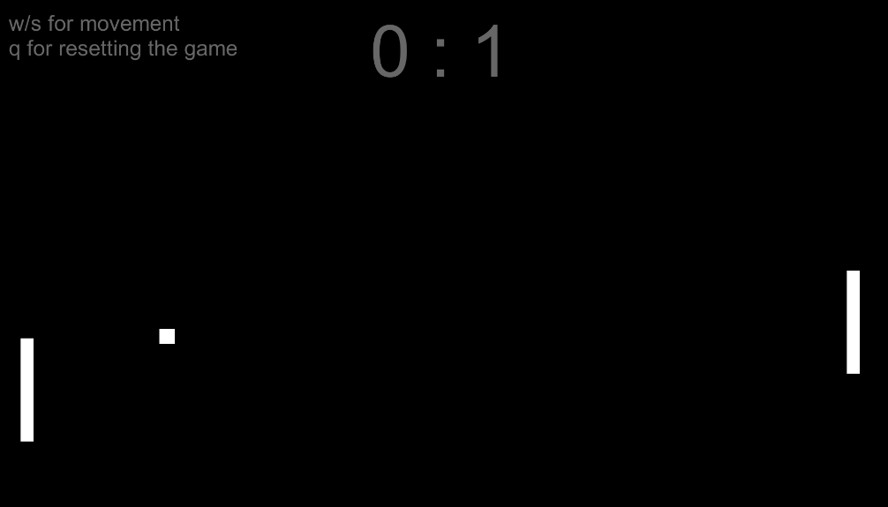

# Pong

Start date : 03-04-2023
End date : 04-04-2023

This is the first game in my attempt to learn more about programming in unity by making 50 games. 
Despite it being the most basic game you can make, it was educational, learned a bit about collisions, how to generate movement,
game state and the like. On to the next one.

What can I do better?
- The paddles were created at the beginning without turning them into templates, meaning any change I made had to be duplicated. 
next time, turn paddles into a template first.
- The organisation of the different objects (paddles, ball, game manager) is not clear at all. What GameObject does what
(beyond the obvious movement) is a little unclear. Next time, can draw out the interactions before I start writing methods.
- Currently, some values are set to public (so can be changed in the inspector) but shouldn't be available. The only reason
they are set to public, is so other objects can access them. There has to be a better way for that.

Features I could have added with more time:
- 2 player mode
- start screen with options
- adjustable difficulty
- a sound when the ball hits something
- a bit more flair in the sprites and background
- a win or lose condition

