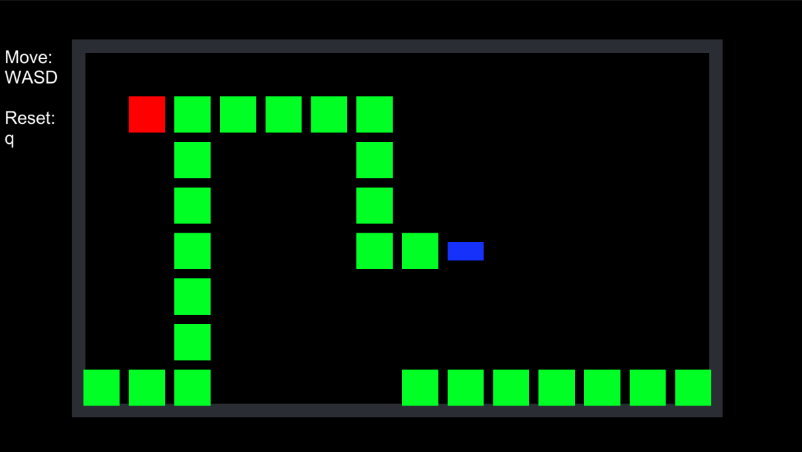

# SNAKE

Start date : 15-04-2023
End date : 16-04-2023

This is the second game in my attempt to learn more about programming in unity by making 50 games. 
Conceptually, snake isn't that much more difficult to understand than the first game, pong. It is only slightly
more involved because the movement of the snake is directly influenced by the state of the board (which directions you can
go and which will block you). Still, this is the beginning of State machine programming, one of the fundamentals of
game programming patterns, so it is a good start.

What can I do better?
- I just started coding this without writing down what would and wouldn't be needed. So I made a lot of 
scripts which I ended up deleting because I came up with more effficient ways later. Currently, it is kind of a
mess. Should take more care with documentation and naming conventions so others could read it.

Features I could have added with more time:
- difficulty sliders
- bombs that result in death
- adjustable field size
- walls you can't pass, so you can have different levels.

