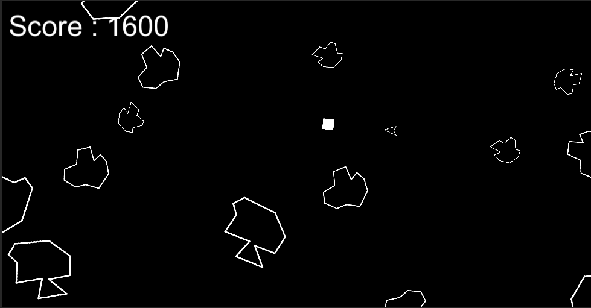

# Asteroids

Start date : 13-01-2024

End date : 14-01-2024

This is the sixth game in my attempt to learn more about programming in unity by making 50 games. 

Life got in the way, and I took a break from learning unity. However, I'm working on it again. Asteroids is a good one
to get back into practice, as it has many basics, movement, different Game states, collisions, etc. Took a bit of 
googling to get back into the swing of things, but here we are again.

What can I do better?
- Need to first write out all different scripts and objects I need. The code I wrote itself is neat, but it could
use with some documentation and maybe even put some shared scripts in another file, so the functionality can be shared

Features I could have added with more time:
- sound (any sound really)
- increasing difficulty over time
- Particles from the engine of the ship
- A more physics based movement
- A parent object for asteroid
- There is a bug where a bullet can hit multiple asteroids if the asteroids are near eachother
- random rotation of the asteroids
- UFOs that fire bullets at the player
- Show the highscore somewhere
- Pause menu

