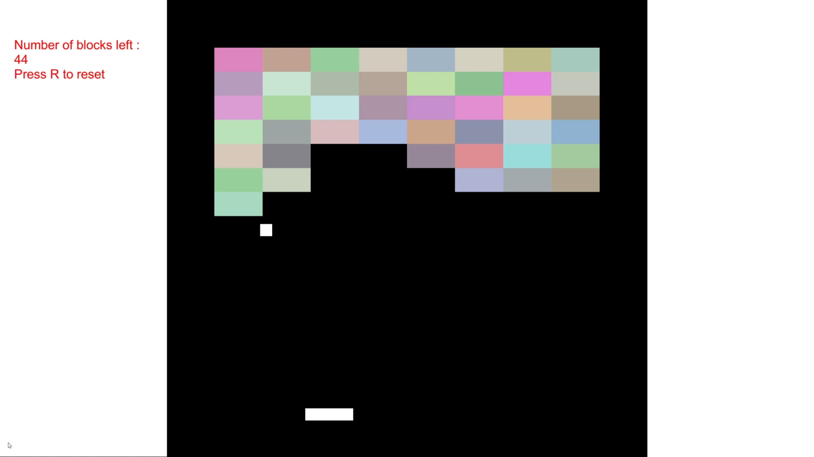

# Asteroids

Start date : 19-01-2024

End date : 21-01-2024

This is the seventh game in my attempt to learn more about programming in unity by making 50 games. 

Brick breaker is classic. Essentially a single player version of pong. I have gotten better at figuring out collision
and such, I can feel the repetition is helping with programming the games (some things I don't have to look up anymore,
which is a good sign.) Also the first time I did something with sound (SFX). 

What can I do better?
- Something is up with the displaying of text on the Canvas, where different screen resolutions will
mess with the alignment and visibility. I should find a tutorial that better explains it.

Features I could have added with more time:
- different levels
- bricks with armor
- Show the highscore somewhere
- Pause menu

