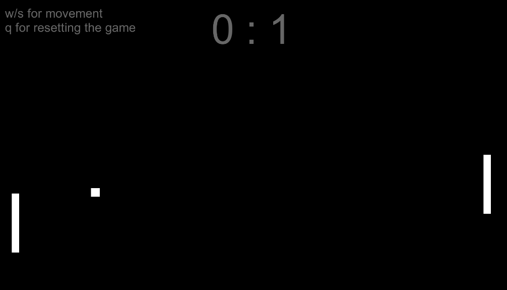
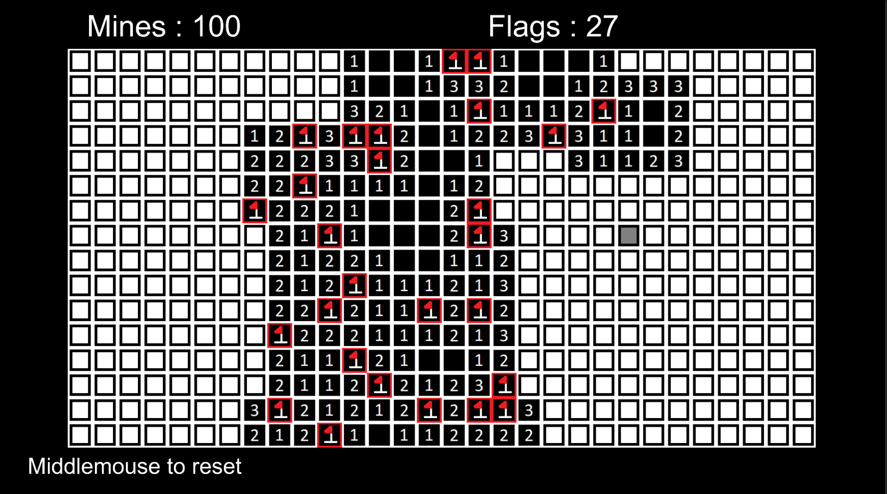
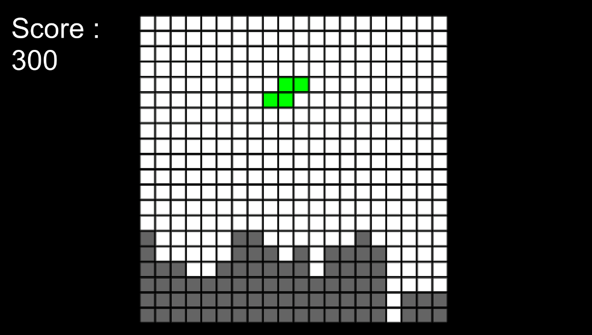
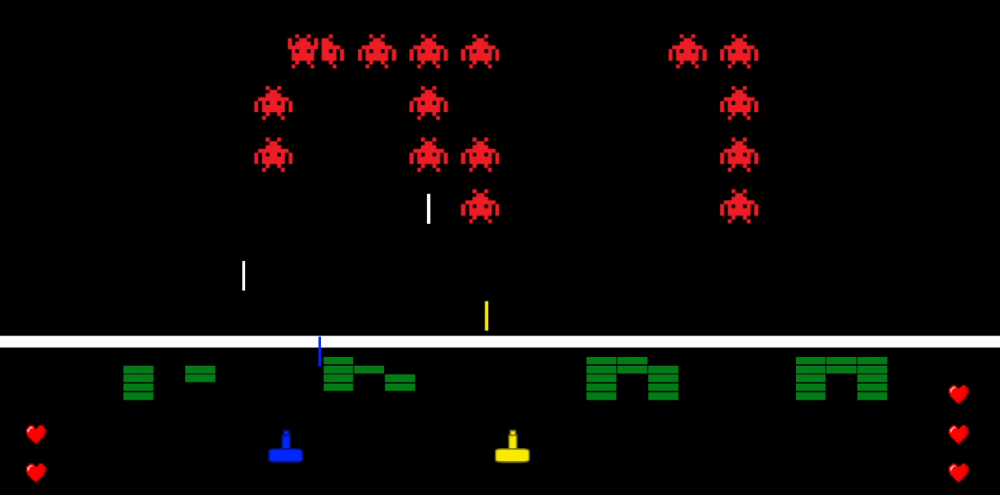

# FiftyUnityGames
This is an attempt to learn unity by making 50 games in the engine, starting with basic recreations of classic arcade games,
then moving onto more complex games, gradually adding my own twists to it.

Games currently in the repository:
- 1 Pong

- 2 Snake

- 3 Minesweeper

- 4 Tetris

- 5 Space invaders with 2 tanks

- 6 Asteroids

